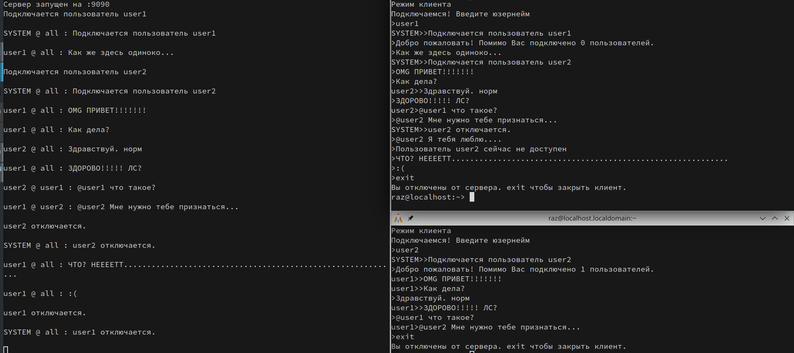

# Задание 3. Локальный чатик (только Go). Вариант 1
Реализован чат который может работать как клиент, так и как сервер.

Использование: go run ./gochat.go -mode [MODE]

MODE - client, server

Функционал:
* Подключение с выбором юзернейма
* Глобальный чат со всеми пользователями
* Приватный чат, начиная сообщение с "@username"
* Системные сообщения о подключении и отключении пользователей

Скриншоты:

